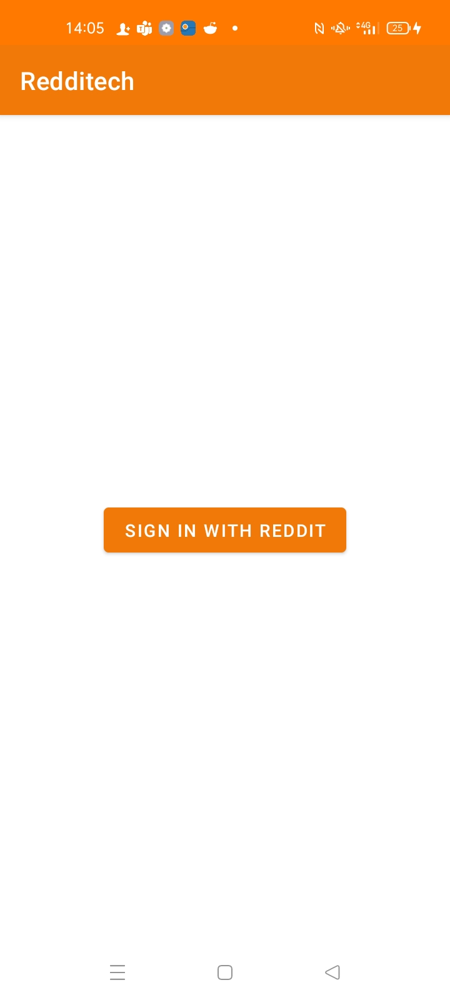
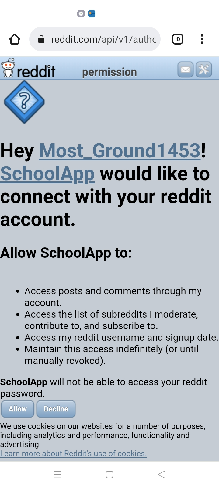
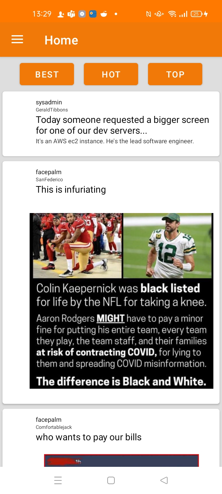
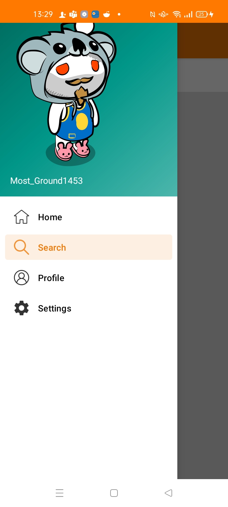
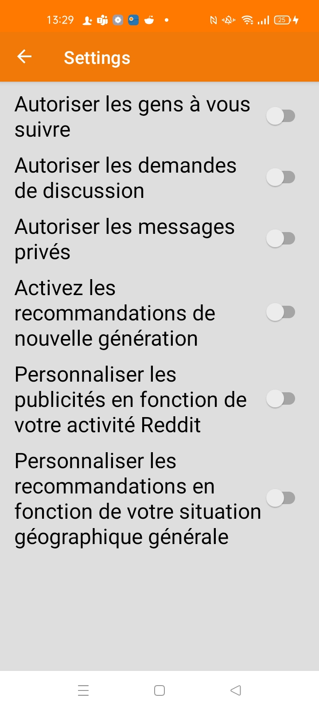
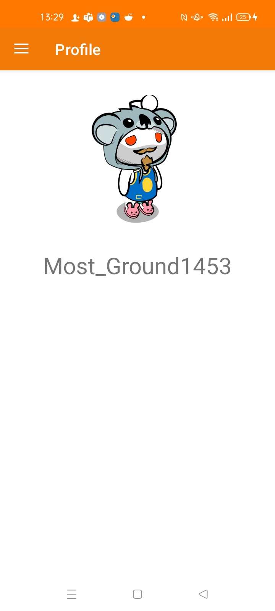
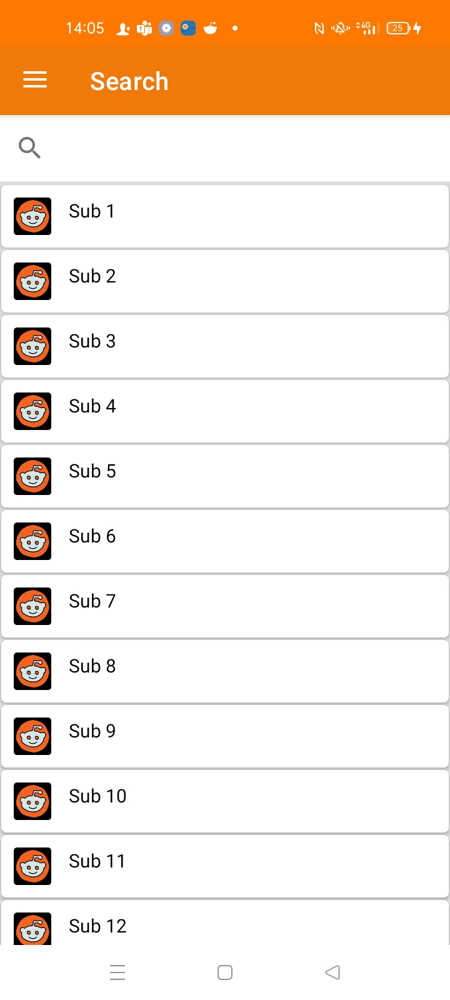

# B-DEV-501-STG-5-1-redditech-maxime.frechard

Redditech Documentation :

This application is a reddit clone with a few features implemented. To use this application, please follow this guide :

First when you launch the application, click on the "SIGN IN WITH REDDIT" button.

You are now redirected to the reddit website where you can register with your reddit account.

When you are registered, you are redirected to the home page of the application. You can see post of the subreddit your are subbed to. You can also sort posts with the button above.

Then you can navigate through the application with the button in the left corner of the application. It opens a menu were you can go to search, your profile or the settings.

You can see and change your settings in the settings page of the application.

You can see your profile picture, name and description in the profile page of the application.

You can search for subreddits in the search page of the application.

